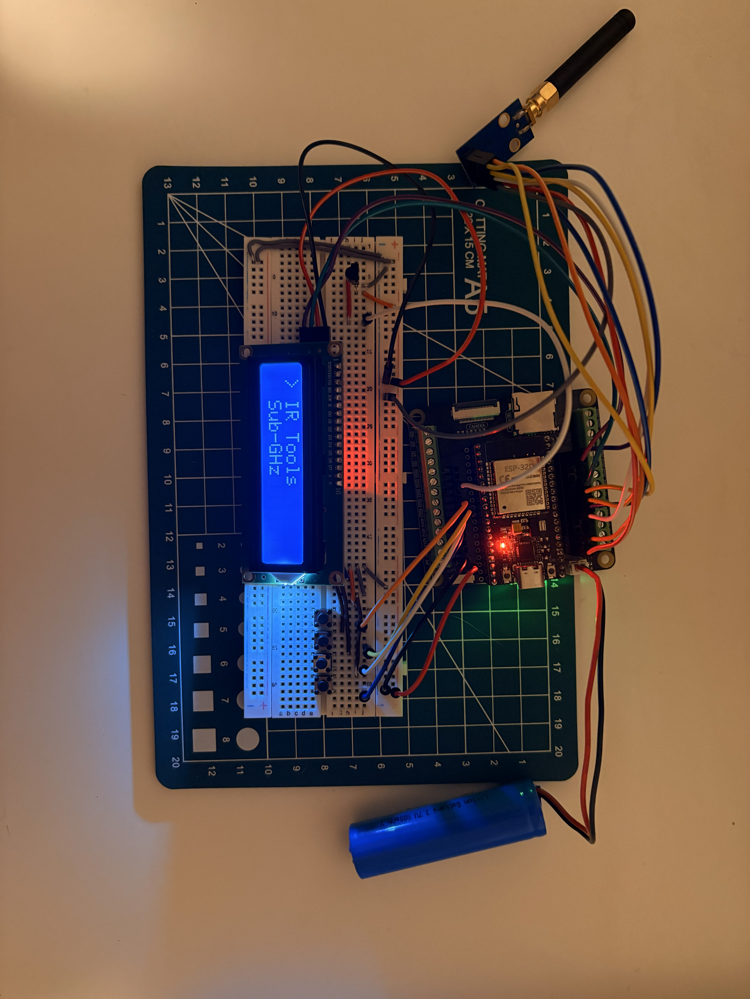

# ESP32 Flipper-Style Multi-Tool

## Goal
Build a menu-driven ESP32 device inspired by handheld multi-tools like the Flipper Zero.  
This project demonstrates how to combine an LCD-based UI, button navigation, and Sub-GHz (CC1101) support into a single modular firmware.

## Language
C++ (Arduino framework)

## Hardware
- ESP32 development board  
- 16×2 I2C LCD (address `0x27`)  
- 4 push buttons (Up, Down, Select, Back)  
- IR receiver module (TSOP-style)  
- CC1101 Sub-GHz transceiver module  
- Jumper wires  
- Breadboard or PCB  

## Software
- PlatformIO (VS Code extension)  
- Arduino framework for ESP32  
- Optional libraries (auto-detected at compile time):
  - LiquidCrystal_I2C  
  - IRremoteESP8266  
  - RadioLib or ELECHOUSE_CC1101  

## Features
- Scrollable 16×2 LCD menu
- Button debouncing and navigation
- Modular app system
  - **Sub-GHz** – CC1101 initialization, frequency switching, RSSI readout
  - **Utilities** – uptime display
  - **Settings** – placeholder for future configuration
- Compile-time feature flags for enabling/disabling modules
- Graceful handling of missing libraries

## Pin Mapping

### Buttons (active LOW, internal pull-ups)
- Up → GPIO 33  
- Down → GPIO 25  
- Select → GPIO 26  
- Back → GPIO 27  

### LCD (I2C)
- SDA → GPIO 21  
- SCL → GPIO 22  

### IR Receiver
- Signal → GPIO 34  

### CC1101 (VSPI)
- SCK → GPIO 18  
- MISO → GPIO 19  
- MOSI → GPIO 23  
- CSN → GPIO 5  
- GDO0 → GPIO 4  
- GDO2 → GPIO 15  

